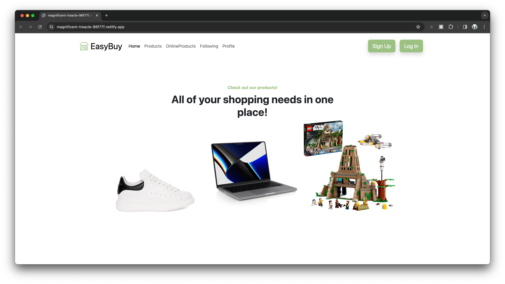
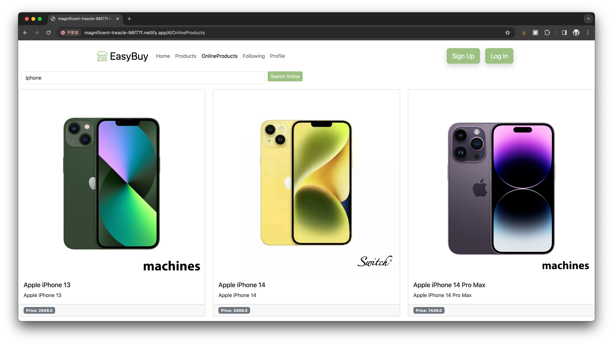
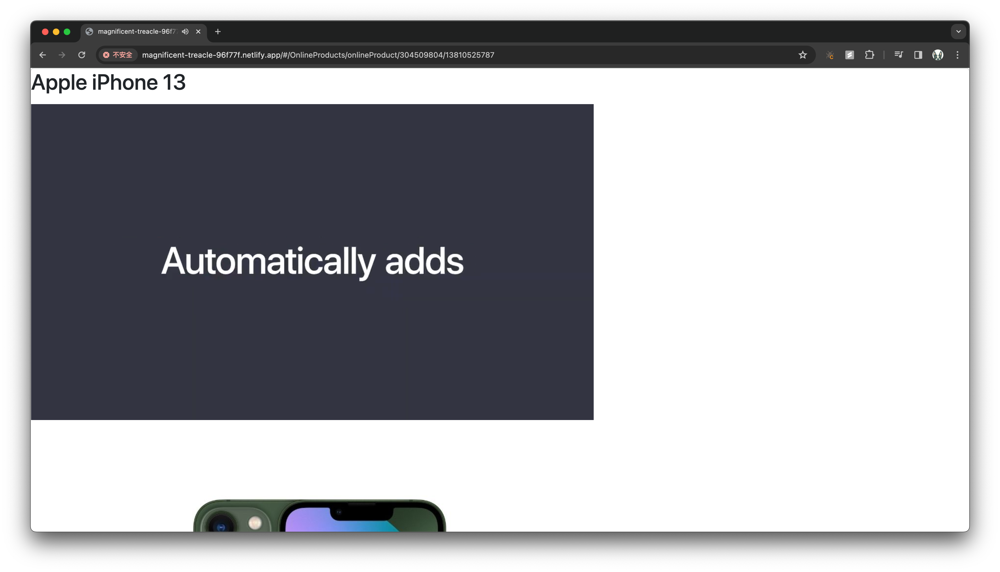
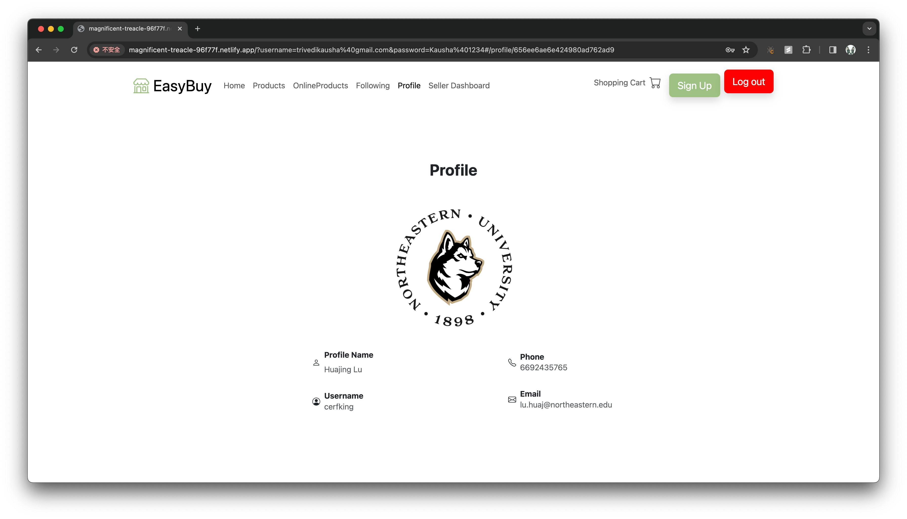

## EasyBuy
EasyBuy

An application used to browse products in the online store, built with React, Redux, JavaScript, and CSS. It is published on Netlify: https://magnificent-treacle-96f77f.netlify.app/

## Project Screen Shots

## Installation and Setup Instructions

Clone down this repository. You will need `node` and `npm` installed globally on your machine.  

Installation:

`npm install`  

To Run Test Suite:  

`npm test`  

To Start Server:

`npm start`  

To Visit App:

`localhost:3000`  

## Reflection

This was a 3 week long project built during my 5800 Web Development class. Project goals included using technologies learned up until this point and familiarizing myself with documentation for new features.  

Originally I wanted to build an application that allowed users to browse products data both from the mongoDB database and external API. I started this process by using the `create-react-app` boilerplate, then adding `react-router-4.0` and `redux`.  

At the end of the day, the technologies implemented in this project are React, React-Router 4.0, Redux. 
